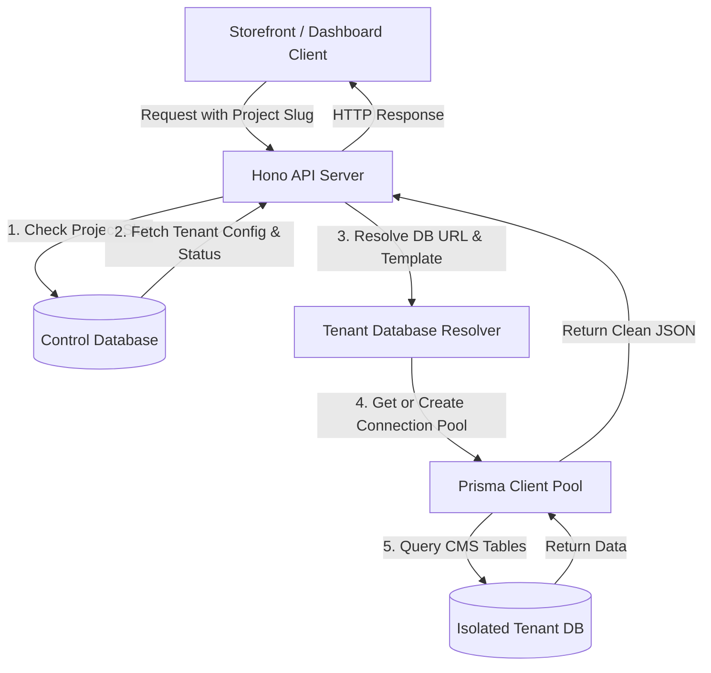
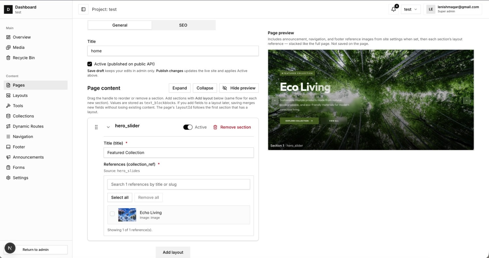
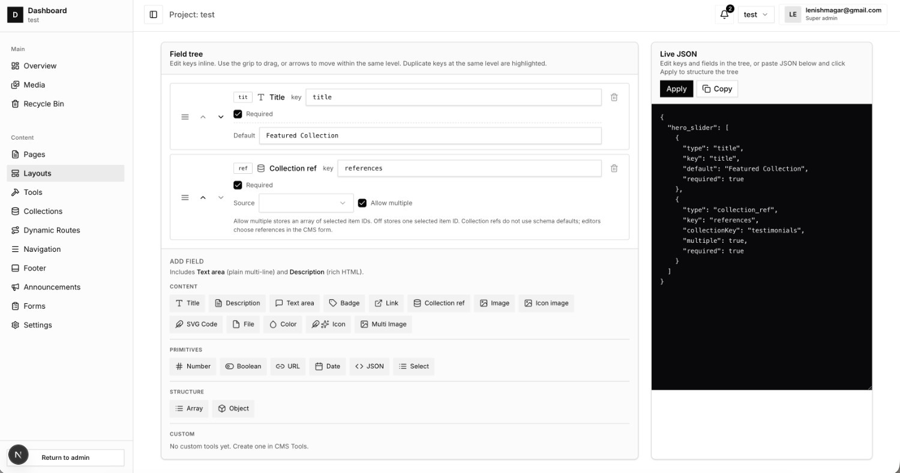
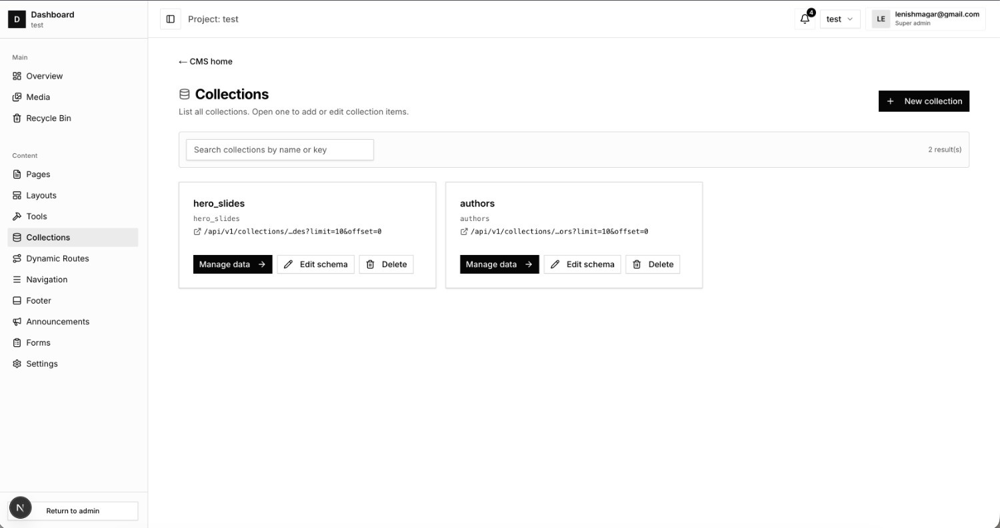
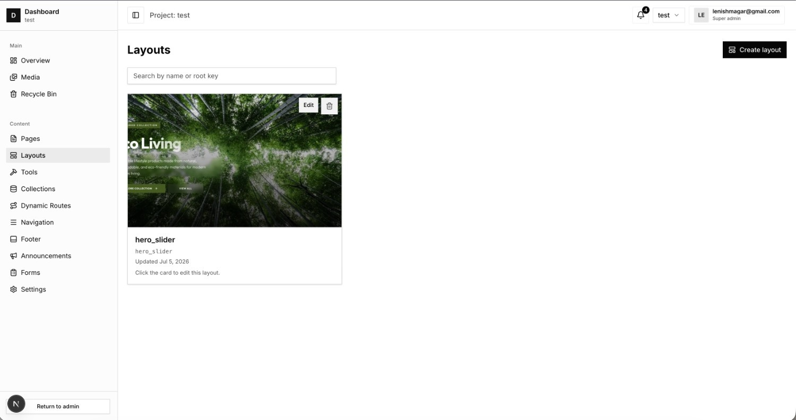
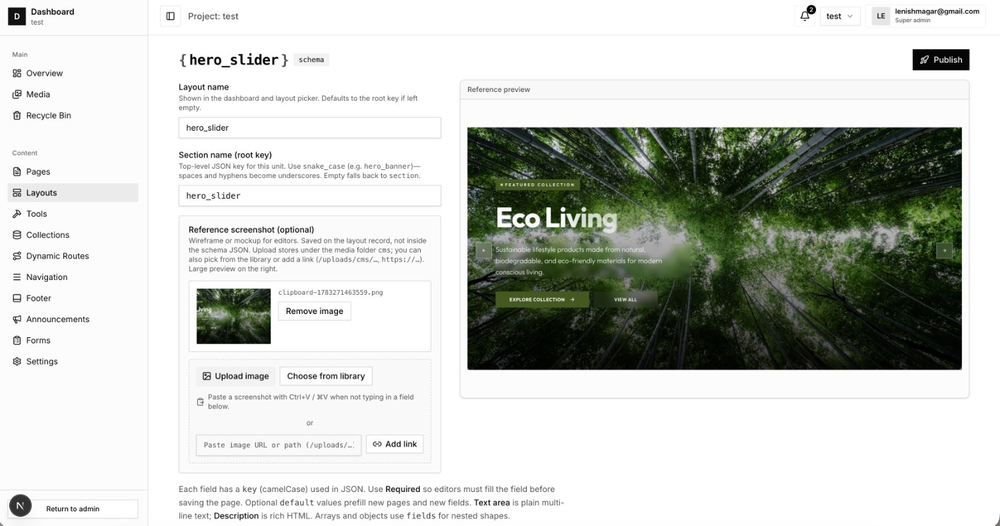
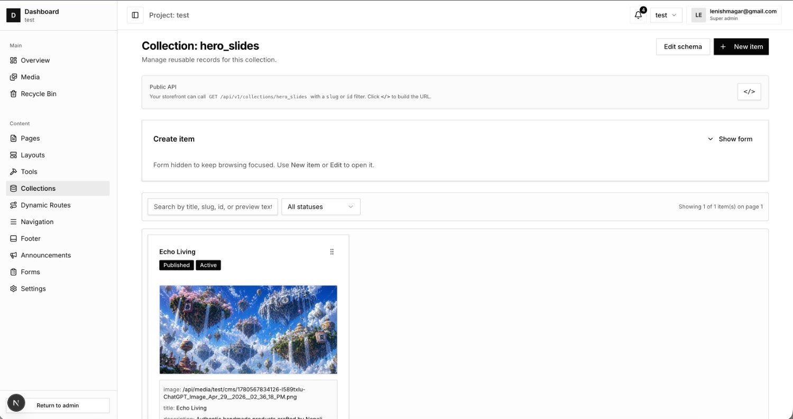

# Tenant Flow CMS Frontend

A Next.js admin dashboard for the **Tenant Flow headless CMS**. It provides visual interfaces to manage multi-tenant projects, page structures, layouts, navigation configs, form definitions, and media scope.

> [!IMPORTANT]
> This is a decoupled headless system. **To run this dashboard, you need the companion backend repository:**
> 👉 **[Tenant Flow CMS Backend](https://github.com/R4V3NSH4D0W/tenant-flow-cms-backend)**

---

## Why Tenant Flow CMS Dashboard? (Benefits)

This dashboard provides workspace configuration views for managers and developers overseeing multi-tenant environments:

1. **Modern Interface**: Built with Framer Motion, GSAP, and Tailwind CSS v4 for UI layout transitions.
2. **Dynamic Project Switching**: Switch workspace context between project databases.
3. **Layout Editing**: Build page schemas, add dynamic blocks, and reorder structural layout hierarchies visually.
4. **Data Tools**: Admin panels for custom collections, database-driven forms, email notification triggers, and API access keys.

---

## What It Can Handle (Use Cases & Scale)

* **Multi-Tenant SaaS Portals**: A single admin hub to manage hundreds of distinct tenant portals.
* **Component-Based Content Builders**: Define visual layout schemas (dynamic blocks) that match your storefront components.
* **Form Submission Tracking**: Review structured user contact inputs, search messages, and download response data.
* **Granular Project Scoping**: Grant specific user roles, revoke permissions, and create read/write API credentials.
* **Media Asset Control**: Visual library management for project images, logos, and gallery media.

---

## Multi-Tenant Architecture



---

## Dashboard Preview

Here is a visual overview of the dashboard interface:

| Page Builder | Layout Structures |
| :---: | :---: |
|  |  |
| *Visual editor with drag-and-drop blocks* | *Defining nested component structures* |

| Collections Manager | Layout Profiles |
| :---: | :---: |
|  |  |
| *Define structured database schemas* | *Visual list of layout wireframes* |

| Creating Layouts | Collection Item Editor |
| :---: | :---: |
|  |  |
| *Registering new template structures* | *Inserting data entries into collection schemas* |

---

## Visual Dashboard Overview

The dashboard shell exposes the following interactive management pages under `/dashboard`:

### 📁 CMS Management (`/dashboard/cms`)
* **Pages (`/pages`)** — Hierarchical listing of all configured site pages. Displays published status, allows scheduling, editing metadata (SEO), and content layout modifications.
* **Layouts (`/layouts`)** — Structural template editors mapping component configuration slots (using `cms-layout-slots-editor`).
* **Collections (`/collections` & `/collection`)** — Visual database editor. Define a key-value schema (e.g. `blog_posts` with `title: string`, `body: rich-text`, `author: string`) and write new items inside a clean spreadsheet-like editor.
* **Forms (`/forms`)** — Lists submissions sent from your public websites. Review submissions, create new form schemas, and set custom SMTP auto-response templates.
* **Dynamic Routes (`/dynamic-routes`)** — Setup pattern-matched routing pathways (e.g. `/blog/:slug` maps to collection key `blog_posts` inside a dynamic layout).
* **Tools (`/tools`)** — Export/import layout components and block definitions.
* **Site Chrome (`/navigation`, `/footer`, `/announcements`)** — Visually design header navigation trees, footer links, and marketing alert messages.

### 🖼 Media Library (`/dashboard/media`)
* Drag-and-drop file uploaders (`cms-file-upload-field`) built over scoped folders.
* Handles images, SVG icons, and trash recovery.

### ⚙ Settings (`/dashboard/settings` & `/dashboard/projects`)
* Manage global settings, register API keys, specify allowed domain origins, and assign user access roles (Project Manager vs. Member).

---

## Technical Component Overview

* **Layout Blocks Editor** (`components/cms/layout-builder/`) — Uses a nested visual tree structure (`block-branch.tsx` & `leaf-default-field.tsx`) to let editors nest widgets within visual parent layout modules.
* **TipTap WYSIWYG Editor** (`cms-html-description-editor.tsx`) — Full-featured rich-text editing engine compiling inline hyperlinks, font styling, and colors directly to sanitized HTML payloads.
* **React Query State Caching** — Utilizes `@tanstack/react-query` to cache project configurations, routes, and page lists.
* **Lucide Icon Pack & Framer Motion** — Drives consistent modern animations and icon designs throughout the admin layout.

---

## Directory Structure

* `/app/` — Next.js App Router folders defining pages (`/dashboard`, `/login`, `/register`, etc.).
* `/components/` — Reusable visual UI components (modals, inputs, layout elements).
* `/hooks/` — Custom React hooks (e.g. data fetching state wrappers).
* `/lib/` — Frontend helpers, schema validations, and HTTP clients.

---

## First-Time Setup

### 1. Install Dependencies
```bash
pnpm install
```

### 2. Environment Configuration
Copy the environment variables template:
```bash
cp .env.example .env
```
Ensure `DATABASE_URL` matches your postgres database settings.

### 3. Start Database (Optional)
If you don't have Postgres running on your system, start it using Docker Compose:
```bash
pnpm docker:db
```

### 4. Database Setup & Seed
Initialize the database tables and populate the default admin credentials:
```bash
pnpm db:setup
```
This runs the migrations and seeds the database with a default user:
* **Email**: `admin@example.com` (or set custom `SEED_EMAIL` in `.env`)
* **Password**: `changeme` (or set custom `SEED_PASSWORD` in `.env`)

### 5. Run Development Server
```bash
pnpm dev
```
Open [http://localhost:3000](http://localhost:3000) to view the application. Go to `/dashboard` to log in.

---

## Useful Commands

| Command | Purpose |
|---|---|
| `pnpm db:ensure` | Creates the database if it doesn't already exist. |
| `pnpm db:setup` | Runs DB check, migrations, and seed scripts. |
| `pnpm db:seed` | Seeds default settings and test admin credentials. |
| `pnpm db:studio` | Opens the Prisma Studio database manager interface. |
| `pnpm dev` | Starts the local Next.js development server. |
