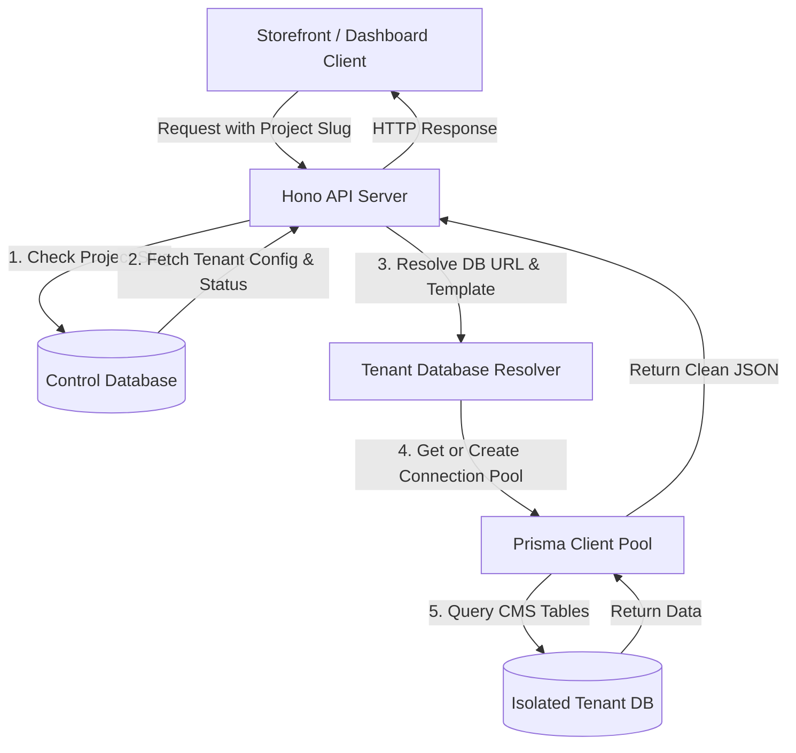

# Tenant Flow CMS Frontend

A beautiful, responsive, and feature-rich Next.js admin dashboard shell for the **Tenant Flow headless CMS**. It provides visual interfaces to manage multi-tenant projects, page structures, layouts, navigation chrome, form definitions, and media scope.

> [!IMPORTANT]
> This is a decoupled headless system. **To run this dashboard, you need the companion backend repository:**
> 👉 **[Tenant Flow CMS Backend](https://github.com/R4V3NSH4D0W/tenant-flow-cms-backend)**

---

## Why Tenant Flow CMS Dashboard? (Benefits)

This dashboard provides a premium workspace for managers and developers overseeing multi-tenant environments:

1. **Fluid User Interface**: Built with Framer Motion, GSAP, and Tailwind CSS v4, the dashboard provides micro-animations, fast transitions, and a premium look-and-feel.
2. **Dynamic Project Switching**: Switch workspace context instantly between completely different client projects with a single click.
3. **No-Code Layout Editing**: Empower non-technical editors to build page schemas, add dynamic blocks, and reorder structural layout hierarchies visually.
4. **Comprehensive Data View**: Complete visual tooling for custom collections, database-driven forms, email notification triggers, and API access keys.

---

## What It Can Handle (Use Cases & Scale)

* **Multi-Tenant SaaS Portals**: A single admin hub to manage hundreds of distinct tenant portals.
* **Component-Based Content Builders**: Define visual layout schemas (dynamic blocks) that match your storefront components.
* **Form Submission Tracking**: Review structured user contact inputs, search messages, and download response data.
* **Granular Project Scoping**: Grant specific user roles, revoke permissions, and create read/write API credentials.
* **Media Asset Control**: Visual library management for project images, logos, and gallery media.

---

## Multi-Tenant Architecture



---

## Features

* **Multi-Project CMS Dashboard**: Switch seamlessly between distinct projects/tenants.
* **Visual Page & Layout Builder**: Design layouts and configure dynamic pages with structured content blocks.
* **Dynamic Collections**: Manage collections of structured data (e.g. blog posts, products) using customizable schemas.
* **Forms & Submissions**: View form submission statistics, download response payload databases, and trigger SMTP alerts.
* **Media Gallery**: Integrated drag-and-drop media upload and library scoping.
* **API Access Management**: Create and revoke project-level API tokens and configure custom domain rules.
* **Interactive UI**: Built with framer-motion, GSAP, Radix UI primitives, and Tailwind CSS v4.

---

## Directory Structure

* `/app/` — Next.js App Router folders defining pages (`/dashboard`, `/login`, `/register`, etc.).
* `/components/` — Reusable visual UI components (modals, inputs, layout elements).
* `/hooks/` — Custom React hooks (e.g. data fetching state wrappers).
* `/lib/` — Frontend helpers, schema validations, and HTTP clients.

---

## First-Time Setup

### 1. Install Dependencies
```bash
pnpm install
```

### 2. Environment Configuration
Copy the environment variables template:
```bash
cp .env.example .env
```
Ensure `DATABASE_URL` matches your postgres database settings.

### 3. Start Database (Optional)
If you don't have Postgres running on your system, start it using Docker Compose:
```bash
pnpm docker:db
```

### 4. Database Setup & Seed
Initialize the database tables and populate the default admin credentials:
```bash
pnpm db:setup
```
This runs the migrations and seeds the database with a default user:
* **Email**: `admin@example.com` (or set custom `SEED_EMAIL` in `.env`)
* **Password**: `changeme` (or set custom `SEED_PASSWORD` in `.env`)

### 5. Run Development Server
```bash
pnpm dev
```
Open [http://localhost:3000](http://localhost:3000) to view the application. Go to `/dashboard` to log in.

---

## Useful Commands

| Command | Purpose |
|---|---|
| `pnpm db:ensure` | Creates the database if it doesn't already exist. |
| `pnpm db:setup` | Runs DB check, migrations, and seed scripts. |
| `pnpm db:seed` | Seeds default settings and test admin credentials. |
| `pnpm db:studio` | Opens the Prisma Studio database manager interface. |
| `pnpm dev` | Starts the local Next.js development server. |
